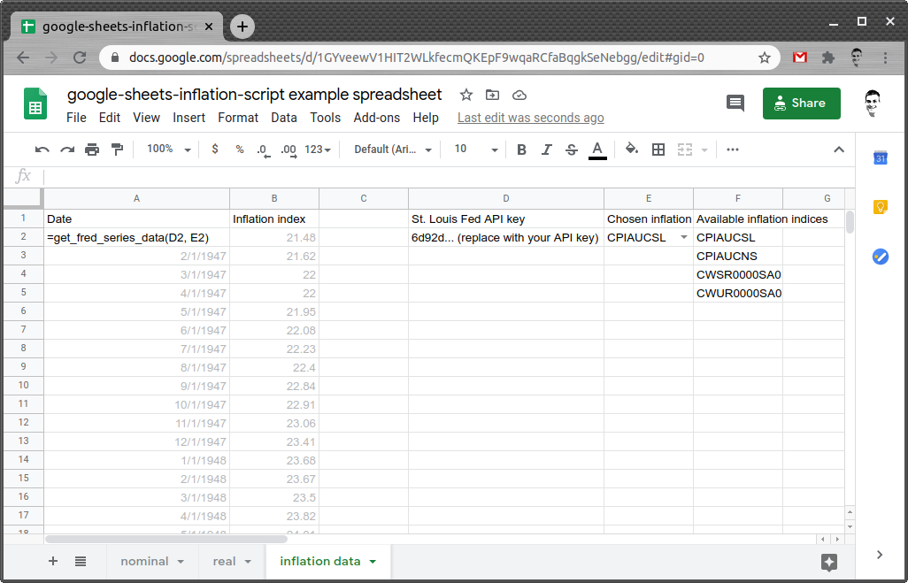

# google-sheets-inflation-script

## Overview

This script provides three functions related to calculating inflation:

* `get_fred_series_data` - This function is used to import inflation data from the FRED (Federal Reserve Economic Data) web service, and put it into table form. The output consists of a first column containing dates, and a second colum containing inflation index values.

	This function should only be called once for a spreadsheet, as the calls out to the web service take time, and will likely be throttled by Google or by FRED if there are too many.

	See the [setup](#Setup) section for more information.

* `get_inflation_index` - This function uses the inflation values outputted by `get_fred_series_data` to find the inflation value for a given date. If a value for the exact date is not found, it will estimate a value through extrapolation. If the `target_date` falls beyond the range of inflation data, extrapolation will still occur using the `predicted_annual_inflation` parameter.

	This function is primarily for internal use by the `adjust_prices_for_inflation` function. Most use cases will have no need to call it directly.

* `adjust_prices_for_inflation` - This is the primary function for performing inflation calculations. It takes original price data and inflation data to return price data for a different date or range of dates.

	See the [usage](#Usage) section for more information.

## Setup

### St. Louis Fed

An API key is required to pull inflation indices from the Federal Reserve's web service (FRED). Alternatively, you may collect inflation data from any other source by whatever means you wish, and not make use of this project's `get_fred_series_data` function.

1. Obtain an API key from the [St. Louis Fed](https://research.stlouisfed.org/docs/api/api_key.html)
2. Test it out by querying `https://api.stlouisfed.org/fred/series/observations?api_key=YOUR_API_KEY&series_id=cpiaucsl&frequency=m&file_type=json`, replacing `YOUR_API_KEY` with the key you obtained in the previous step. A successful request will return a large amount of inflation data in json format. A failure will show an error message.

### Google Sheets

#### Importing inflation data from FRED into your spreadsheet

1. From a Google Sheets document, choose `Tools > Script editor`
2. Copy the source code from this repository's [Code.gs](Code.gs) file to the Google Apps Script file that opens up
3. Save and close the Google Apps Script file. You may name it whatever you want, I called it `inflation`.
4. Import inflation data from FRED using the `get_fred_series_data` function as shown, or import it yourself using whichever method you want.

	* *the gray cells are populated automatically by the function in **cell A2** *
	* ***Cell E2** has data validation on it to allow for easy selection of various indices as listed in **column F**. `Data > Data validation > Criteria: List from a range: F2:F`, `On invalid data: Reject input`*

## Usage

### Performing inflation calculations

Calculations can be performed by the `adjust_prices_for_inflation` function. It can be used in one of three ways:

| input | output | example |
| - | - | - |
| range of prices at range of dates | range of prices at single date | `=adjust_prices_for_inflation(nominal!A2:A, nominal!B2:B, B2,'inflation data'!A2:B)` |
| single price at single date | range of prices at range of dates | `=adjust_prices_for_inflation(nominal!A2, nominal!B2, A2:A,'inflation data'!A2:B)` |
| single price at single date | single price at single date | `=adjust_prices_for_inflation(nominal!A2, nominal!B2, B2,'inflation data'!A2:B)` |

*These examples assume dates are in **column A** of a sheet named `nominal`, and prices are in **column B** of the current sheet*
